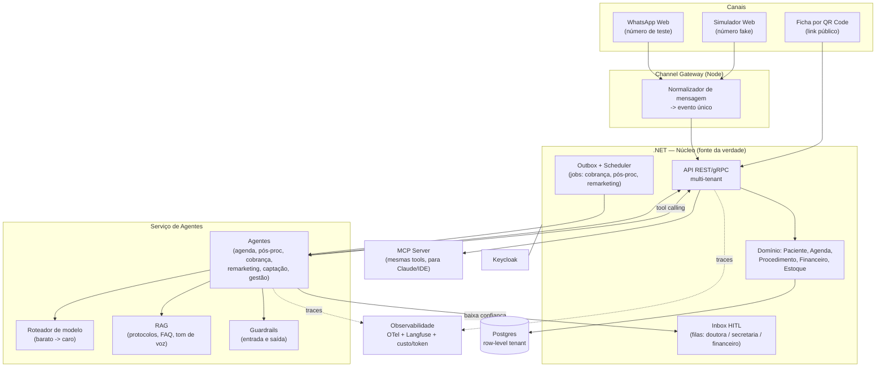

# Clínica Inteligente — Plano de Construção

> Documento de discussão. Nada foi implementado ainda.
> Objetivo duplo: (a) entregar um sistema real de gestão de clínica estética com agentes de IA;
> (b) atravessar, com implementação própria, os conceitos cobrados em vagas de **Engenheiro de IA**:
> LLM, Tool Calling, Agentes, RAG, Guardrails, HITL, Evals, Observabilidade, MCP.

---

## 1. Princípio norteador do projeto

O erro clássico de projeto de aprendizado é começar pelo agente. Agente é a **última** camada.
Um agente só é útil se existir um domínio determinístico embaixo dele — agenda, paciente,
pagamento, estoque — com regras de negócio confiáveis. O LLM não deve *decidir* nada crítico;
ele **interpreta linguagem natural, escolhe qual ferramenta chamar e escreve texto no tom certo**.
A verdade fica sempre no banco, nunca no contexto do modelo.

Consequência prática para o roadmap: **Fases 0–2 quase não têm IA.** Elas constroem o "chão"
(multi-tenant, domínio, agenda, financeiro) que vira o *toolset* dos agentes. Sem isso, o
agente vira chatbot de demonstração — exatamente o que não impressiona em entrevista.

Segundo princípio: **todo agente nasce em modo sugestão (HITL), e só depois é promovido a autônomo.**
Isso não é só segurança — é o mecanismo que gera o dataset de avaliação. Cada aprovação/edição/rejeição
humana é um rótulo. Sem isso, você não tem eval; tem opinião.

---

## 2. Arquitetura macro



**A regra de ouro do desenho:** o agente **não tem acesso ao banco**. Ele só enxerga o mundo
através de *tools* que são endpoints da API .NET — com as mesmas validações, o mesmo
multi-tenant e a mesma auditoria que a UI usa. Isso resolve segurança, testabilidade e,
de brinde, entrega o MCP quase de graça (mesmo contrato de tools, outro transporte).

---

## 3. Stack e custo

| Camada | Escolha | Custo | Por quê |
|---|---|---|---|
| Backend núcleo | .NET 9 — **monolito modular** (não microserviços) | grátis | Um deploy, transações reais, refatoração barata. Microserviço aqui é custo sem benefício. |
| Serviço de agentes | Python (FastAPI) **ou** .NET — ver §11 | grátis | Decisão aberta. |
| Frontend | Next.js (App Router) + shadcn/ui | grátis | Vercel free para o painel. |
| Auth | Keycloak (container) | grátis | Exigência sua. Detalhe em §5. |
| Banco | Postgres | grátis até ~0,5 GB (Neon/Supabase) | Um banco só: relacional + JSONB + `pgvector` para RAG. Evita subir vector DB separado. |
| Fila / jobs | Postgres + outbox + worker .NET | grátis | Não subir Redis/RabbitMQ antes de precisar. |
| Canal WhatsApp | Node (`whatsapp-web.js` ou Baileys) em container | grátis | Ver riscos em §9. |
| Hospedagem | **Oracle Cloud Free Tier** (VM ARM, sempre grátis, ~4 vCPU / 24 GB) | grátis | Único free tier que aguenta .NET + Keycloak + Postgres + Langfuse juntos. Alternativas: Fly.io, Hetzner (~€4/mês) se quiser menos dor. |
| Observabilidade | OpenTelemetry + **Langfuse self-hosted** + Grafana/Prometheus | grátis | Langfuse = traces de LLM (prompt, tokens, custo, latência) + datasets de eval. |
| Evals | Suíte própria + Langfuse datasets (+ promptfoo opcional) | grátis | Rodando em CI. |
| LLMs | Ver §7 — camadas grátis do Gemini/Groq no dev, pago só onde precisa | ~R$0 em dev | |

**Custo alvo de desenvolvimento: R$ 0/mês.** Em produção real com 1 clínica, estimativa
inicial de LLM na casa de poucos dólares/mês com o roteamento da §7 — a validar com dados reais
na Fase 5 (o número só existe depois que houver telemetria de tokens).

---

## 4. Multi-tenant

Modelo: **um banco, um schema, coluna `tenant_id` em toda tabela** (shared-everything).
É o mais barato e o suficiente para dezenas/centenas de clínicas.

Regras não negociáveis desde o primeiro commit:
1. `tenant_id` obrigatório em toda entidade (herda de uma base `TenantEntity`).
2. **Global query filter** no EF Core — impossível escrever query sem filtro por acidente.
3. `tenant_id` vem **sempre** do token (claim), **nunca** de body/query/header do cliente.
4. **RLS no Postgres** como segunda barreira: se o filtro do ORM falhar, o banco recusa.
5. Teste automatizado de vazamento entre tenants desde a Fase 0 (tenant A tenta ler dado de B → 404).

Papéis: `OWNER` (dona), `DOCTOR`, `SECRETARY`, `FINANCE`, e `AGENT` (identidade de máquina para os
agentes — com permissões **menores** que as de humano; ex.: agente pode remarcar, mas não pode dar desconto).

---

## 5. Keycloak

- **Um realm só** (`clinica`), tenants como *Organizations* (recurso nativo do Keycloak 26+) ou como grupos.
  Realm por tenant vira inferno operacional; evitar.
- Claims no token: `tenant_id`, `roles`, `user_id`.
- Next.js autentica via OIDC (Authorization Code + PKCE); .NET valida JWT.
- Agentes usam **client credentials** com service account própria (papel `AGENT`), não o token de um humano.
  Isso deixa a auditoria honesta: dá pra distinguir "a secretária remarcou" de "o agente remarcou".

---

## 6. Modelo de dados (núcleo, primeira versão)

```
Tenant, User(keycloak_sub, tenant_id, role)
Patient(tenant_id, nome, telefone_e164, nascimento, consentimentos)
AnamnesisForm / AnamnesisResponse   (versionado — ficha muda com o tempo)
Procedure(nome, duracao_min, preco, custo_insumos)
Appointment(patient, doctor, procedure, inicio, fim, status)
  status: agendado -> confirmado -> realizado | faltou | cancelado
Payment(appointment, valor, vencimento, status, metodo)
StockItem / StockMovement(entrada, saida, procedimento_origem)
ConversationThread(tenant_id, patient?, canal, telefone) 
Message(thread, direcao, texto, autor: paciente|humano|agente, meta)
AgentRun(thread?, agente, input, output, modelo, tokens, custo, latencia, trace_id, veredito_guardrail)
HitlTask(fila, prioridade, motivo, payload_sugerido, status, resolvido_por)
AuditLog(quem, o quê, quando, antes/depois)  -- inclui ações de agente
KnowledgeDoc / KnowledgeChunk(embedding vector)  -- RAG, por tenant
```

Detalhe que costuma ser esquecido e é caro depois: **telefone em E.164** desde o início
(`+5511987654321`), e `ConversationThread` chaveada por telefone **antes** de existir paciente
(o item 7 — número desconhecido — depende disso).

---

## 7. Camada de IA (o coração do aprendizado)

### 7.1 Gateway de LLM e roteamento por custo

Um único ponto de saída para modelos, com interface própria (`ILlmClient` / `LlmClient`).
Nunca chamar SDK de provider espalhado pelo código — senão trocar de modelo vira refatoração.

Política de roteamento em **3 níveis**:

| Nível | Tarefa | Modelo (exemplo) |
|---|---|---|
| **S** (barato/rápido) | classificação de intenção, detecção de sentimento, extração de campo, "é sim ou não?", roteamento | **Haiku 4.5** |
| **M** (padrão) | conversa com o paciente, tool calling de agenda, redação de mensagem | **Sonnet 5** |
| **L** (caro) | relatório de gestão (item 8), análise de caso pós-procedimento com alerta clínico, resumo semanal | **Opus 5** |

> Provedor único: **Anthropic** (única key disponível hoje). O gateway mantém a interface
> agnóstica, então acrescentar Gemini/Groq depois é registrar outro adaptador — não refatorar.

Mecanismos de economia (todos viram bullet de currículo):
- **Cascata**: nível S tenta primeiro; se confiança < limiar, escala para M. Mede-se a taxa de escalada.
- **Prompt caching** do system prompt + contexto do tenant.
- **Cache semântico** de perguntas frequentes (embedding + limiar de similaridade).
- **Orçamento por tenant/dia**: estourou, degrada para HITL em vez de gastar. (Falha para o lado seguro.)
- Registro de `tokens_in/out`, custo e latência **em toda chamada** → dashboard de custo por agente.

### 7.2 Tool Calling

As tools são a API .NET. Primeiro conjunto:

```
buscar_paciente(telefone|nome)
consultar_agenda(data_inicio, data_fim, doutora?)
buscar_horarios_livres(procedimento_id, janela)
agendar(paciente, procedimento, inicio, doutora)
remarcar(appointment_id, novo_inicio)
cancelar(appointment_id, motivo)
consultar_pendencias_financeiras(paciente_id)
gerar_cobranca_pix(payment_id)
registrar_resposta_pos_procedimento(appointment_id, nota, texto)
abrir_tarefa_hitl(fila, motivo, payload)   <- a tool mais importante do sistema
enviar_mensagem(thread_id, texto)          <- sempre sujeita a guardrail
```

Disciplina: toda tool é **idempotente** (chave de idempotência), **escopada por tenant** e
**auditada**. Tool de escrita nunca é chamada sem confirmação explícita do paciente na conversa
ou aprovação humana, dependendo do nível de autonomia do agente.

### 7.3 Agentes

Cada agente = **persona + política + toolset + gatilho + nível de autonomia**. Não é "um prompt gigante".

| # | Agente | Gatilho | Autonomia inicial |
|---|---|---|---|
| 6 | **Agenda** (confirmar/remarcar/cancelar) | cron (dia anterior) + mensagem recebida | sugere → autônomo |
| 3 | **Pós-procedimento** | X horas após `realizado` | autônomo p/ perguntar, HITL p/ escalar |
| 2 | **Cobrança** | vencimento | autônomo p/ 1ª cobrança, HITL nas demais |
| 5 | **Remarketing** | X dias sem agendamento futuro | HITL até calibrar (risco de irritar cliente) |
| 7 | **Captação** (número desconhecido) | mensagem de telefone sem paciente | sempre HITL no começo |
| 9 | **Secretária da doutora** | comando da doutora | confirma o plano antes de executar em lote |
| 10 | **Otimizador de agenda** | cron diário | **sempre sugestão** — quem oferece é o humano |
| 8 | **Gestão/BI** | cron semanal | sempre relatório (não age) |

Sobre "falar no mesmo tom": isso **não** se resolve com `"seja simpática"` no prompt.
Resolve-se com **Style Profile por tenant e por papel**: um registro contendo tom, formalidade,
emojis (usa? quais?), saudação típica, vocabulário proibido, e **6–12 mensagens reais** da doutora/secretária
usadas como few-shot. Isso é dado de tenant, editável na UI, e é o que faz o sistema parecer humano.
O item 8 (Style Profile) é, na minha opinião, o maior diferencial de produto da lista inteira.

### 7.4 RAG

O que vai para a base vetorial (por tenant): protocolos de pós-operatório por procedimento,
FAQ da clínica (preços, endereço, formas de pagamento, política de cancelamento), contraindicações,
descrições de procedimentos, e o histórico anonimizado de respostas aprovadas pela doutora.

O que **não** vai: agenda, financeiro, dados do paciente. Isso é consulta estruturada via tool.
Confundir os dois é o erro nº 1 de quem está aprendendo RAG — LLM não deve "lembrar" de saldo devedor.

Implementação: `pgvector` no mesmo Postgres, chunking com metadados (`tenant_id`, `procedimento_id`,
`versao`), busca híbrida (vetorial + full-text do Postgres) e **citação obrigatória da fonte** na
resposta interna, para o eval conseguir medir *groundedness*.

### 7.5 Guardrails

**Entrada:** detecção de prompt injection, PII fora de contexto, mensagem fora de escopo,
urgência médica (palavras-chave tipo dor forte/sangramento/febre → **rota de emergência imediata**,
sem passar por LLM), e limite de custo.

**Saída (antes de qualquer envio ao paciente):**
- Não prometer resultado clínico, não dar diagnóstico, não alterar preço fora da tabela.
- Não inventar horário que não existe (validação contra a agenda — checagem determinística, não "confia no modelo").
- Não vazar dado de outro paciente.
- Tom coerente com o Style Profile.
- **Toda mensagem que falha em guardrail vira HitlTask** — nunca é descartada em silêncio.

Nota importante: guardrail bom é **determinístico primeiro** (regex, lookup, validação contra o banco)
e **LLM-as-judge depois**, só para o que é subjetivo (tom, empatia). Guardrail que é só "outro prompt"
é caro e frágil.

### 7.6 HITL — o item 12 da sua lista

Três filas, uma por papel, alimentadas automaticamente:
- **Doutoras**: pós-procedimento com sinal de problema, dúvida clínica, paciente insatisfeita.
- **Secretaria**: intenção não compreendida, pedido fora do escopo, conflito de agenda.
- **Financeiro**: cobrança sem resposta, recusa de pagamento, negociação pedida.

Cada tarefa mostra: conversa, **o que o agente sugeriu**, por que escalou, e botões
**Aprovar / Editar e enviar / Rejeitar**. As três ações são gravadas — e é exatamente esse log
que vira o **dataset de eval** e o material de few-shot para melhorar o tom. HITL e Evals são o
mesmo sistema visto de dois ângulos.

### 7.7 Evals

Três camadas, rodando em CI a cada mudança de prompt:
1. **Unitários de tool calling**: dada a mensagem X, o agente chamou a tool certa com os args certos? (assertivo, barato, rápido)
2. **Golden set de conversas**: ~50 diálogos reais/sintéticos por agente, com resultado esperado.
   Métricas: acurácia de intenção, taxa de escalada correta, alucinação de horário, aderência ao tom.
3. **LLM-as-judge** para o subjetivo (tom, empatia, clareza), com rubrica escrita e calibrada
   contra julgamentos humanos.

Regra: **prompt não muda sem eval rodar**. Regressão de prompt é invisível sem isso — e saber
disso é metade do que diferencia "engenheiro de IA" de "pessoa que usa ChatGPT".

### 7.8 Observabilidade

OpenTelemetry ponta a ponta: `trace_id` nasce na mensagem do WhatsApp e atravessa gateway → API →
agente → chamadas de LLM → tools → resposta. Langfuse para a camada de LLM (prompt, resposta,
tokens, custo, latência, versão do prompt). Dashboards: custo por agente/dia, taxa de escalada
para HITL, latência p95 de resposta, taxa de guardrail acionado, e — o que interessa ao negócio —
taxa de confirmação de agenda e de conversão de remarketing.

### 7.9 MCP

Duas frentes, ambas úteis:
1. **MCP Server da clínica**: expõe as mesmas tools (agenda, paciente, financeiro) via MCP,
   permitindo que a dona da clínica consulte o sistema pelo Claude Desktop
   ("quantas faltas tivemos essa semana?"). Como as tools já existem, é adaptador, não reescrita.
2. **MCP Clients** consumidos pelo agente (ex.: calendário externo).

---

## 8. Canais: WhatsApp real + simulador

Ambos entram no sistema pelo **mesmo evento normalizado** — essa é a decisão-chave:

```json
{ "tenant_id": "...", "canal": "whatsapp|simulador", "de": "+5511999999999",
  "para": "+5511888888888", "texto": "...", "message_id": "...", "timestamp": "..." }
```

O núcleo **não sabe** de onde a mensagem veio. Vantagens: dá para desenvolver e rodar todos os evals
sem WhatsApp nenhum, e o simulador vira a ferramenta de teste manual do dia a dia.

**Simulador** (página no Next): campo de telefone fake + nome, chat estilo WhatsApp, painel lateral
mostrando em tempo real o que o agente pensou — tools chamadas, modelo usado, tokens, custo,
guardrails acionados. Essa tela é o melhor material de portfólio do projeto inteiro; vale caprichar.

**WhatsApp real**: container Node com `whatsapp-web.js`/Baileys, QR code para parear o número de teste,
sessão persistida em volume. Riscos honestos: é biblioteca não-oficial, o WhatsApp pode banir o número,
e a API muda. Por isso ele fica **isolado atrás de uma interface** — trocar por Cloud API oficial
(Meta) depois é mudar um adaptador. Nunca usar número pessoal.

---

## 9. Riscos e conformidade

- **LGPD / dado de saúde**: anamnese é dado sensível. Consentimento explícito no formulário do QR Code,
  criptografia em repouso dos campos sensíveis, retenção definida, e log de acesso.
- **Nada de diagnóstico**: guardrail duro. O agente coleta e escala; quem avalia é a doutora.
- **Rota de emergência**: sinal de complicação → notifica humano **imediatamente**, sem depender de LLM.
- **Consentimento de contato**: opt-out obrigatório no remarketing (item 5) — e respeitado no banco.
- **WhatsApp não-oficial**: risco de bloqueio. Mitigado por isolamento + limite de envios.
- **Custo de LLM fora de controle**: orçamento por tenant + alerta + degradação para HITL.

---

## 10. Roadmap por fases

Cada fase entrega algo demonstrável e um conceito de IA fechado. Estimativas assumem trabalho
de fim de semana / algumas horas por dia — ajuste conforme seu ritmo.

### Fase 0 — Fundação (sem IA) · ~1 semana
Monorepo, docker-compose (Postgres + Keycloak), solução .NET modular, Next.js com login OIDC,
`tenant_id` + global filter + RLS, seed de 2 clínicas, teste de isolamento entre tenants, CI básica.
**Pronto quando:** login com 2 usuários de clínicas diferentes e o teste de vazamento passa.

### Fase 1 — Núcleo clínico · ~2 semanas
CRUD de paciente, procedimento, agenda (com detecção de conflito), pagamentos e estoque.
Abas do item 11. Sem nenhuma IA.
**Pronto quando:** dá para operar a clínica manualmente pelo sistema.

### Fase 2 — Anamnese por QR Code (item 1) · ~4 dias
Formulário versionado, link público assinado com expiração, QR code, consentimento LGPD,
ficha aparecendo no prontuário.
**Pronto quando:** celular lê o QR, preenche, e a doutora vê no sistema.

### Fase 3 — Canal + Simulador · ~1 semana
Evento normalizado, `ConversationThread`/`Message`, página do simulador, container do WhatsApp Web.
Ainda **sem LLM** — responde com eco/regra fixa.
**Pronto quando:** mensagem entra pelos dois canais e aparece na mesma thread.

### Fase 4 — Primeiro agente: Agenda (item 6) · ~2 semanas 🎓 *LLM + Tool Calling + Agente*
Gateway de LLM, agente de confirmação/remarcação com tool calling real, Style Profile da secretária,
loop de conversa com estado. Roda **em modo sugestão** (tudo cai no HITL).
**Pronto quando:** no simulador, "posso mudar pra quinta às 15h?" resulta na tool certa e numa
sugestão de resposta no tom da secretária.

### Fase 5 — Observabilidade + Roteamento de custo · ~1 semana 🎓 *Observabilidade*
OTel ponta a ponta, Langfuse, custo/token por chamada, roteador S/M/L, cache, orçamento por tenant.
**Pronto quando:** você abre um trace e vê a jornada inteira de uma mensagem, com custo em R$.

### Fase 6 — Guardrails + HITL (item 12) · ~1,5 semana 🎓 *Guardrails + HITL*
Guardrails de entrada/saída, rota de emergência, as três filas com Aprovar/Editar/Rejeitar,
log de decisão humana. Promove o agente de agenda a autônomo nos casos de alta confiança.
**Pronto quando:** mensagem problemática nunca chega ao paciente sem humano.

### Fase 7 — RAG (base de conhecimento) · ~1 semana 🎓 *RAG*
`pgvector`, ingestão de protocolos e FAQ por tenant, busca híbrida, citação de fonte,
uso no agente de pós-procedimento.
**Pronto quando:** "posso tomar sol depois do preenchimento?" é respondido com base no protocolo da clínica, citando a fonte.

### Fase 8 — Agentes de pós-procedimento (3) e cobrança (2) · ~2 semanas
Jobs agendados, PIX (começar com QR estático/copia-e-cola; gateway depois), classificação de resposta,
resumo para a doutora, escalonamento automático.
**Pronto quando:** paciente responde "tá doendo um pouco" e a doutora recebe o resumo na fila dela.

### Fase 9 — Evals · ~1,5 semana 🎓 *Evals*
Golden sets por agente (alimentados pelo log de HITL das fases anteriores), testes de tool calling,
LLM-as-judge com rubrica, eval rodando em CI, relatório de regressão.
**Pronto quando:** mudar um prompt e ver o número da suíte mudar antes do merge.

### Fase 10 — Remarketing (5) e Captação (7) · ~1,5 semana
Regras de elegibilidade, opt-out, agente de primeiro contato para número desconhecido,
qualificação e handoff para a secretária.
**Pronto quando:** número desconhecido manda "quanto custa botox?" e vira lead qualificado.

### Fase 11 — MCP · ~4 dias 🎓 *MCP*
MCP Server expondo as tools da clínica; conectar no Claude Desktop.
**Pronto quando:** você pergunta ao Claude "quantas faltas essa semana?" e ele consulta o sistema real.

### Fase 12 — Secretária das doutoras (9) e Agenda inteligente (10) · ~2 semanas
Cancelamento em lote com plano confirmado antes de executar, motor de otimização de agenda
(determinístico) + agente que só redige a oferta de adiantamento.
**Pronto quando:** "cancela minha quinta" gera plano, confirma, remarca e avisa todo mundo.

### Fase 13 — Agente de gestão (8) · ~1 semana
Métricas determinísticas primeiro (procedimento mais rentável, captação, faltas, ticket médio),
LLM só para narrar e apontar prioridades. Relatório semanal.
**Pronto quando:** a dona recebe um review semanal que ela leria de verdade.

### Fase 14 — Produção · ~1 semana
Deploy na VM free tier, HTTPS (Caddy/Cloudflare Tunnel), backup do Postgres, alertas, runbook.

**Total estimado: ~4–5 meses** em ritmo de projeto paralelo. As Fases 0–6 já formam um produto
vendável e cobrem 5 dos 9 conceitos.

---

## 11. Decisões

### Já decididas

**1. Linguagem do serviço de agentes — HÍBRIDO.** ✅
`.NET 9` no núcleo de domínio (agenda, paciente, financeiro, estoque, multi-tenant, HITL) e
`Python (FastAPI)` no serviço de agentes (LLM, tool calling, RAG, guardrails, evals).
Contrato HTTP entre os dois; o Python **não** acessa o banco — só chama tools da API .NET.

**2. Provedor de LLM — Anthropic (Claude), único.** ✅
Roteamento S/M/L = Haiku 4.5 / Sonnet 5 / Opus 5. Gateway agnóstico para trocar depois.

### Ainda em aberto

**3. Hospedagem.** Oracle Free Tier é grátis mas historicamente chato de conseguir a VM ARM.
Aceita a alternativa Hetzner (~R$25/mês) se a Oracle travar?

**4. PIX.** Começamos com QR estático/copia-e-cola manual (grátis) ou você já tem conta PJ com
gateway (Asaas/Mercado Pago têm sandbox grátis)?

**5. Clínica real.** Existe uma clínica de verdade por trás disso (com doutoras reais para dar
o tom e validar), ou é projeto de portfólio? Isso muda bastante a prioridade das fases.

**6. Ritmo.** Quantas horas por semana? Se for pouco, corto o escopo das Fases 10–13 e foco em
fazer as 0–9 muito bem — que é o que rende em entrevista.
